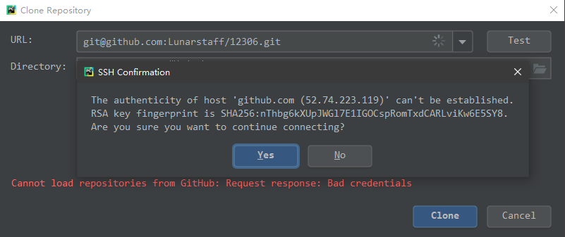

### 在GitHub中添加 ssh Key
- 问题描述：
我从GitHub上找到一个感兴趣的Python项目，想clone到本地研究一下，但是在PyCharm上
用ssh克隆的时候用Git从项目checkout的时候提示无法建立连接，无法正常clone下来，项目
连接是`git@github.com:Lunarstaff/12306.git`

>目前猜测是我邮件账号出问题了，收不到 GitHub的验证邮件。

