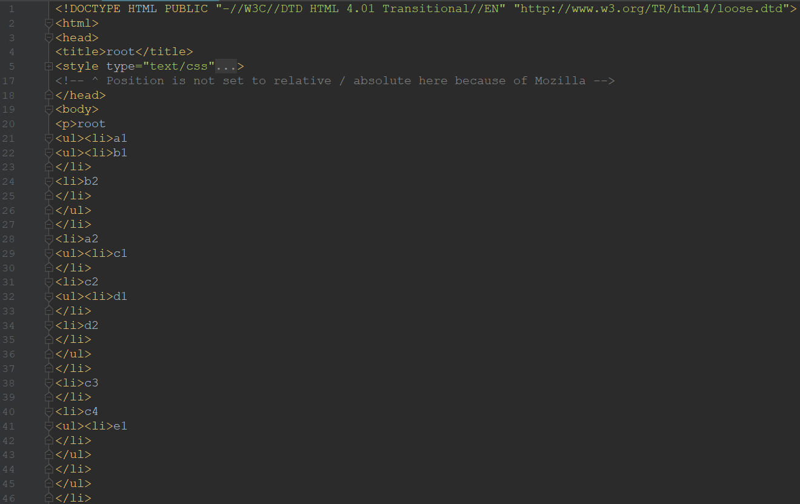

- #### 最开始的想法
我现在手工测试，在工作中会经常把测试点（测试案例）写在思维导图中（可以是用freemind，
或其他思维导图软件），然后导出成为xxx.html格式的文件，再通过一个前辈编写的vbs脚本结
合测试案例模板，将刚才的xxx.html文件生成excel文件。  
这个vbs脚本的功能就是把html文件中的标签内容按照思维导致的结构组成测试案例，然后根据
测试案例模板进行内容复制。

我在想，我是不是可以使用Python及相关模块把html（或者思维导致导出的其他格式的文件）解
析出来，再生成测试案例，实现一个比前辈的vbs脚本更灵活，更好用的测试案例生成工具？

- #### 思路整理
    - 我今天在办公室里尝试了使用html.parser模块，这个模块可以解析html标签，但是也仅仅是解析
无法满足我对标签内容按照思维导致的结构进行重组的需求。
    - 所以尝试另外一个XML处理模块，这个模块我大概看了下，可以识别到标签结构的root，以及
其子结点，父结点，所以我想这个应该可以满足我的需求了，下需尝试实现。

- #### 实现过程
    - 如下我先用freemind做了一个简单的思维导图：  
    
    
    - 从freemind中导出为html格式的文件[`root.mm.html`](./root.mm.html)
    - 打开html文件就知道，我们只需要解析`body`中的元素就可以了。  
    
    - 经过尝试[`xml_par.py`](./xml_par.py)，发现只用xml也不是可以简单就能实现：
        ```
        # xml_par.py
        import xml.etree.ElementTree as et
        tree = et.parse("./root.xml")
        r = tree.getroot()
        print(r.tag)
        for i in r:
            print(i.tag)
            for j in i:
                print(i.tag)
        ```
        输出如下：
        ```
        body
        ul
        ul
        ul
        ul从
        ```  
    - xml与html文本最大的区别就是：
        - xml中所有的元素都是闭合的，有<a>，就一定有<\a>
        - html中允许<a>xxx 这样的元素存在，xml却解析不了
    - 这个方法还需要说明一点，从freemind导出，只能导出为html格式，
    如果想直接用xml，还需要手工把文件编辑一遍，我累不累呀~~

---
    
- #### 需要另外想办法了...
    - 鉴于freemind只能导出为html文件，且xml不可以直接解析html文件，所以决定使用html来解析。
    - 仍然使用从freemind中导出为html格式的文件[`root.mm.html`](./root.mm.html)。  
    
    - 还是先用htmlparse试下，不行再用bs4，我也是没办法呀。就是最后如果真的用bs4做出来了，估计也不好推广。

---

- ##### 使用html解析
    - html模块包括`entities`和`parser`两个模块  
    
    - html.entities是HTML实体定义，我暂时没用到这个，先不写了。
    - html.parse具有宽松解析模式的HTML / XHTML 解析器
    - html.parse定义了一个`HTMLParse`类，为HTML（超文本标记语言）和XHTML 文本文件解析提供基础。
        ```python
        class html.parser.HTMLParser(*, convert_charrefs=True)

        ```
    


