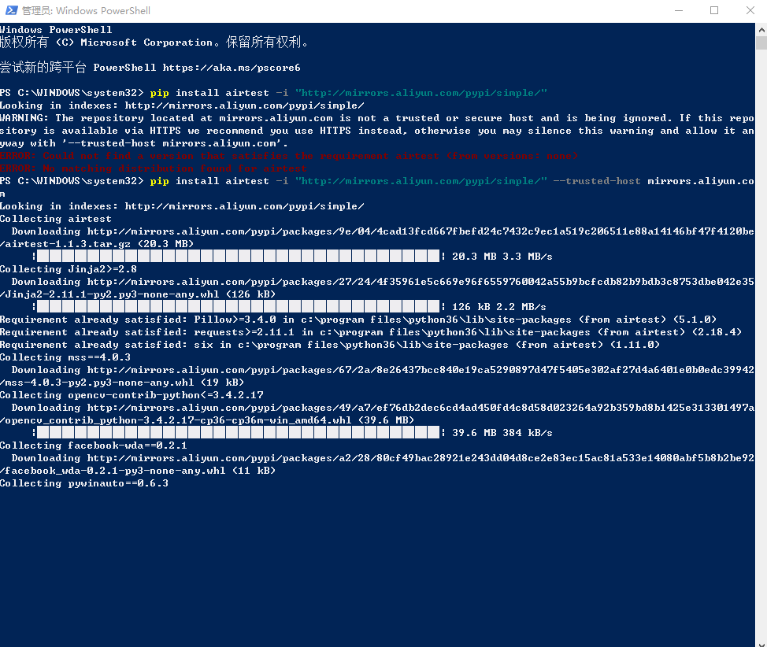

## 使用指定镜像地址安装Python第三方库

因为在不同的地方网络环境也不一样，新的Python环境安装第三方库的时候如果直接从官方镜像地址
安装第三方库可能会出现连接超时安装失败的情况，下面说明一下指定镜像地址安装第三方库的方法。
>国内常用的镜像地址有：  
>（1）阿里云 http://mirrors.aliyun.com/pypi/simple/  
（2）豆瓣 http://pypi.douban.com/simple/  
（3）清华大学 https://pypi.tuna.tsinghua.edu.cn/simple/  
（4）中国科学技术大学 http://pypi.mirrors.ustc.edu.cn/simple/  
（5）华中科技大学 http://pypi.hustunique.com/  

- **临时**使用某镜像地址安装第三方库  
例如，使用阿里镜像安装airtest在控制台执行：
    ```shell script
    pip install airtest -i "http://mirrors.aliyun.com/pypi/simple/"
    ```
    如果执行以上命令时报错如下，提示`WARNING: The repository located at mirrors.aliyun.com is not a trusted or secure host and is being ignored. If this repository is available via HTTPS we recommend you use HTTPS instead, otherwise you may silence this warning and allow it anyway with '--trusted-host mirrors.aliyun.com'.`  
    ```shell script
    PS C:\WINDOWS\system32> pip install airtest -i "http://mirrors.aliyun.com/pypi/simple/"
    Looking in indexes: http://mirrors.aliyun.com/pypi/simple/
    WARNING: The repository located at mirrors.aliyun.com is not a trusted or secure host and is being ignored. If this repository is available via HTTPS we recommend you use HTTPS instead, otherwise you may silence this warning and allow it anyway with '--trusted-host mirrors.aliyun.com'.
    ERROR: Could not find a version that satisfies the requirement airtest (from versions: none)
    ERROR: No matching distribution found for airtest
    ```
    那就在上面命令的基础上再加上`"--trusted-host mirrors.aliyun.com"`
    ```shell script
    PS C:\WINDOWS\system32> pip install airtest -i "http://mirrors.aliyun.com/pypi/simple/" --trusted-host mirrors.aliyun.com
    Looking in indexes: http://mirrors.aliyun.com/pypi/simple/
    Collecting airtest
      Downloading http://mirrors.aliyun.com/pypi/packages/9e/04/4cad13fcd667fbefd24c7432c9ec1a519c206511e88a14146bf47f4120be/airtest-1.1.3.tar.gz (20.3 MB)
         |████████████████████████████████| 20.3 MB 3.3 MB/s
    Collecting Jinja2>=2.8
    ```
    就可以正常安装成功了。  
      

- **固定**使用某镜像地址安装第三方库
    - Windows系统
        在用户目录（我这台电脑就是`C:\Users\lywte\`）下新建文件夹pip，在新建的pip目录中新建pip.ini文件，在pip.ini文件中写入配置
        ```
        [global]
        index-url = https://mirrors.aliyun.com/pypi/simple/
        
        [install]
        trusted-host=mirrors.aliyun.com
        ```
    - Linux系统  
        - 在用户目录下找到pip配置文件：`~/.pip/pip.conf`，然后在配置文件中添加或修改：
        ```
        [global]
        index-url = https://mirrors.aliyun.com/pypi/simple/
        
        [install]
        trusted-host=mirrors.aliyun.com
        ```
        - 或者在控制台执行如下命令进行配置
        ```
        pip config set global.index-url https://mirrors.aliyun.com/pypi/simple/
        ```


