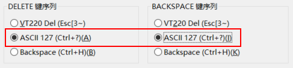

# 问题：
>使用xshell输进指令时，如果输入错误想要回退，这时按键盘上的[backspace]或者[delete]键都无法删除，反而
在命令行出现了"^H"和"^[[3~"的字符。按下了[Ctrl] + [C]组合键才退出了此次输入。  

# 处理方法：
> - 打开[当前会话]的**属性**对话框，在[终端] - [键盘]这一项的设置界面会看到[backspace]和[delete]键的键
序列分别是"VT220 Del(Esc[3~)"和"Backspace(Ctrl+H)"，所以才会出现上面的错误。  
>  
>  
>- 只需要把[backspace]和[delete]键的键序列分别改成下图所示的"ASCII 127"就好了。  
>  