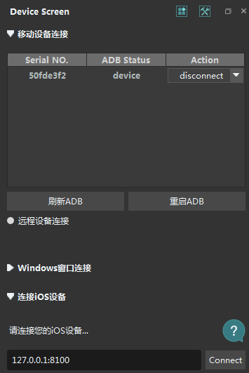
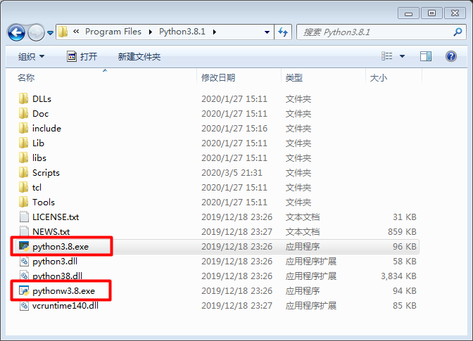
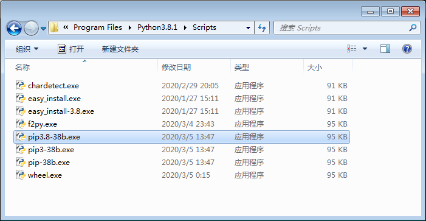

# AirTestIDE + Python 自动刷快手
### 一、系统环境和工具
1. 系统环境
我这台2011年的旧台式机，安装的是Win7系统，同时需要安装Java、Python，注意配置好环境变量。
2. 工具
	- Airtest IDE  
自己去[官网]( "http://airtest.netease.com/")下载安装irtest IDE，我安装的这个版本大小是163MB。不太会用的可以参考[官方文档]("http://airtest.netease.com/docs/en/0_quick_start_guide.html#step-0-before-you-start")
	- APK Messenger  
[APK Messenger](http://www.bkill.com/download/161300.html)是一个轻便的工具包，下载下来是APK Messenger.zip（已上传到百度网盘App目录下），里面包含了aapt.exe 和 APK Messenger.exe等五个工具。

### 二、确认ADB（Android Debug Bridge）是否能够正常连接到手机  
ADB 是Google官方提供的Android调试工具，由于AirtestIDE与相关的库都需要依赖ADB操作，因此如果无法通过`adb devices`看到自己的设备的话，就无法继续使用AirtestIDE，请务必确认手机能够正确连接到PC。
在Airtest内置adb的目录（因为没有给这个东西配置环境变量，所以要切到它所在的目录下启动cmd命令窗口）下AirtestIDE/airtest/core/android/static/adb/windows 执行 `adb.exe devices`正常情况下，应该得到的返回内容示例:  
```shell
C:\Users\Lunar12>adb devices
List of devices attached
50fde3f2        device
```  
如果未能正常出现上述输入，需要检查以下几个方面：  
- 检查电脑上是否已经安装了该款手机对应的官方USB驱动软件，如果尚未安装驱动的话就检测不到手机。请自行查阅手机品牌官网，下载官方驱动进行安装。  
- 需要保证数据线与电脑的USB接口和手机连接的可靠性，建议尽量使用机箱背面的USB接口，主机正面的USB接口可能稳定性较差。
- 手机上需要将开发者选项开启，并开启USB调试选项，并且在接入电脑时，选择允许该PC对设备进行调试，否则手机状态为unauthorized是无法连接的。
- 确认电脑上所有手机助手类型的软件均已关闭，且进程都已完全退出（大部分手机助手都需要手工在任务管理器里终止进程）

### 三、连接设备
启动Airtest IDE，打开设备窗口，在设备列表中看到已识别到的设备后点连接，下图是设备已连接状态。


### 四、找到apk安装包的包名和默认启动名（初始Activity） 
这次只需要使用 aapt.exe 就可以一下子找到包名和初始Activity
**方法一：**使用APK Messenger中的aapt工具：

1. 因为aapt.exe 没有设置环境变更，所以要在aapt.exe目录下启动命令提示符窗口。
2. 执行命令`aapt dump badging 安装包名称`
```shell
C:\Users\Lunar12\Downloads\arpmesse_bkill.com\APK Messenger4.1>aapt dump badging "C:\Users\Lunar12\Desktop\21479726.apk"
package: name='xxxx.xx.xxx' versionCode='198' versionName='2.2.0.198'
sdkVersion:'16'
targetSdkVersion:'26'
...此处省略N行...
launchable-activity: name='yyy.yyyyy.yyyyyyy.yyyyyyyyy' label='Kwai' icon=''
```
3. 取到包名为： `name='xxxx.xx.xxx'`，向下翻找到初始Activity为：`launchable-activity: name='yyy.yyyyy.yyyyyyy.yyyyyyyyy'`。

**方法二：**使用APK Messenger中的`APK Messenger.exe`
1. 打开`APK Messenger.exe`
2. 把目标安装包apk文件拖放到APK Messenger界面上，就会自动分析显示包名和初始Activity

**方法三：** 也可以在AirTestIDE中，连接设备后在设备窗口右上角打开手机助手（Android手机就是 Android assistant）,可以看到就是复制不出来。


### 五、开始写脚本  
1. 启动AirTestIDE，启动时可跳过登录
2. 连接设备
3. 编写执行的时候 需要用到 adb，所以要把 adb（D:\Program Files\AirtestIDE_2020-01-21_py3_win32\airtest\core\android\static\adb\windows）添加到环境变量中，修改环境变更后需要重启AirTestIDE
4. 为了定位页面元素，在窗口菜单打开Poco辅助窗口，在Poco辅助窗口中选择“Android”，等待下面渲染出页面结构。
5. 主体脚本如下：  
```python
# -*- encoding=utf8 -*-
__author__ = "Lunar12"

from airtest.core.api import *
from time import sleep
from random import randint

from poco.drivers.android.uiautomation import AndroidUiautomationPoco
poco = AndroidUiautomationPoco(use_airtest_input=True, screenshot_each_action=False)

auto_setup(__file__)

# 启动快手
def start_apk(apk_name, apk_active):
    # 调用系统命令窗口执行命令
    os.popen('adb shell am start -n %s/%s' % (apk_name, apk_active))


# 跳过等操作
def skip_over():
    # 先是新安装的应用会弹出隐私协议，需要点同意
    try:
        poco("com.kuaishou.nebula:id/button").wait_for_appearance(15)
        poco("com.kuaishou.nebula:id/button").click()
    except:
        print("不是新安装的应用！")
    finally:
        try:
            poco("com.kuaishou.nebula:id/close").wait_for_appearance(20)
            poco("com.kuaishou.nebula:id/close").click()
        except:
            print("未弹出分享得红包提示框！")


# 上滑视频操作
def scroll_up():
    while True:
        sleep(randint(5, 9))
        poco("android.view.View").swipe([0.0193, -0.6574], duration=0.3)

# 主函数

# 定义apk包名和初始Active
'''
package: name='com.kuaishou.nebula' versionCode='198' versionName='2.2.0.198'
sdkVersion:'16'
launchable-activity: name='com.yxcorp.gifshow.HomeActivity'  label='Kwai' icon=''
'''
apk_package_name = "com.kuaishou.nebula"
defalu_activte = "com.yxcorp.gifshow.HomeActivity"

start_apk(apk_package_name, defalu_activte)
# skip_over()
scroll_up()
```

### 六、遇坑记录
1. Python多版本
我这台电脑我今年刚回来的时候安装过一次Python，当时Python3.8.1是最新出来的版本，于是迫不急待地安装了最新的版本。但是在我安装pocoui库的时候发现python3.8.1不能安装低版本的opencv_contrib_python（这中间的坑我就不写了，花了太多时间），又不得不在电脑上安装了python3.6.5版本。安装容易使用难，我现在的Win7安装了两个版本的Python3，一个是Python3.8.1，一个是Python3.6.5，这里记录一下处理方法：

- 下载安装多个版本的Python3是没有问题的，就想安装哪个就安装哪个就好了，把安装目录分开放好。

- 安装好多个版本后就是使用会有点麻烦

- Python的默认启动  
启动Python的时候一般是在命令窗口输入`Python`，但是有多个版本的时候，直接输入`Python`会让你的电脑感到很困惑，它不知道是启动3.6.5还是启动3.8.1，这时只需要把不想使用的那个版本安装目录下的`python.exe`和`pythonw.exe`改一下名称，让你的电脑不认识这个版本的Python就好了，比如，我把3.8.1版本里面的`python.exe`和`pythonw.exe`分别改成了`python3.8.exe`和`pythonw3.8.exe`如下图：  
  
这样再在命令窗口输入`python`就可以启动那个没有改过的Python版本了  
```shell
C:\Users\Lunar12>python
Python 3.6.5 (v3.6.5:f59c0932b4, Mar 28 2018, 16:07:46) [MSC v.1900 32 bit (Inte
l)] on win32
Type "help", "copyright", "credits" or "license" for more information.
>>>
```

- pip的默认启动
然后就是pip的默认启动了，同样的方法，把不想使用的版本中的`pip.exe`，`pip3.exe`，`pip3.6.exe`文件名全部改一下，比如我把这些文件改成了`pip-38b.exe`，`pip3-38b.exe`，`pip3.6-38b.exe`，如下图：  
   
这样再在命令窗口输入pip及pip对应的命令时就会是没有改过的那个版本的pip了  
```shell
C:\Users\Lunar12>pip -V
pip 20.0.2 from d:\program files\python36-32\lib\site-packages\pip (python 3.6)
```

但是如果出错了，就重新安装一下对应版本的pip
```shell
C:\Users\Lunar12>python3.6 -m pip install --upgrade pip --force-reinstall
```

- 第三方库的安装
以上两步处理好之前，安装第三方库就和之前一样的，在命令窗口执行`pip install 库名`，这样安装的第三方库只对当前使用的Python版本有效。

2. 再次运行脚本时出现`adb server version (39) doesn't match this client (40)` 的错,这是因为你的电脑安装了，鲁大师手机助手，360手机助手占用了adb的端口引起的。因为套接字的唯一性（一个套接字只能由 协议/网络地址/端口号 唯一确定 ），一个电脑只能有一个程序关联对应的端口，对于adb对应的端口就是5037。为了验证你的5037端口是否被占用，可以用`netstat -ano|findstr “5037”` 去查找5037对应的端口号的进程id也就是pid，如果有相应的pid，就证明此端口5037有程序占用了。
```shell
C:\Users\Lunar12>netstat -ano | findstr 5037
  TCP    127.0.0.1:5037         0.0.0.0:0              LISTENING       5360
  TCP    127.0.0.1:5037         127.0.0.1:5229         ESTABLISHED     5360
  TCP    127.0.0.1:5229         127.0.0.1:5037         ESTABLISHED     4488
```
查询对应IPD的进程信息
```shell
tasklist |findstr “5360”
C:\Users\Lunar12>tasklist | findstr "5360"
adb.exe                       5360 Console                    1      6,032 K
```
结束对应的进程  
- 方法一：  
`taskkill /pid 5360 -t -f`
- 方法二：  
在任务管理器中找到adb.exe的进程 结束掉
- 方法三：
修改adb的默认端口
在我的电脑下配置一下环境变量：
新建一个环境变量
变量名为：  ANDROID_ADB_SERVER_PORT 
变量值为： 可以给自己设定一个数值，主要是为了不要和其他的程序端口冲突，建议10000——60000 之间，随便找一个数值。
我给自己这里设置为 ANDROID_ADB_SERVER_PORT = "23333"


