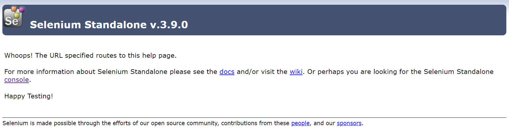
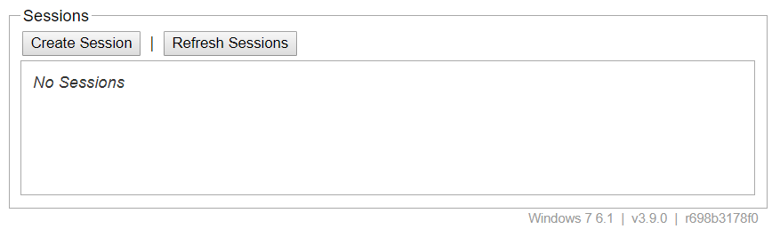
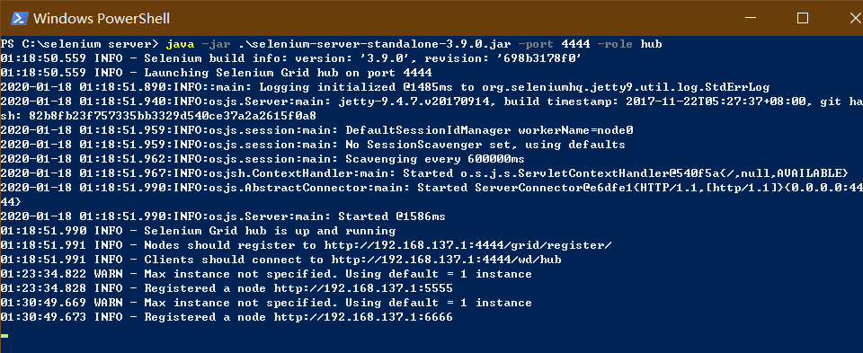
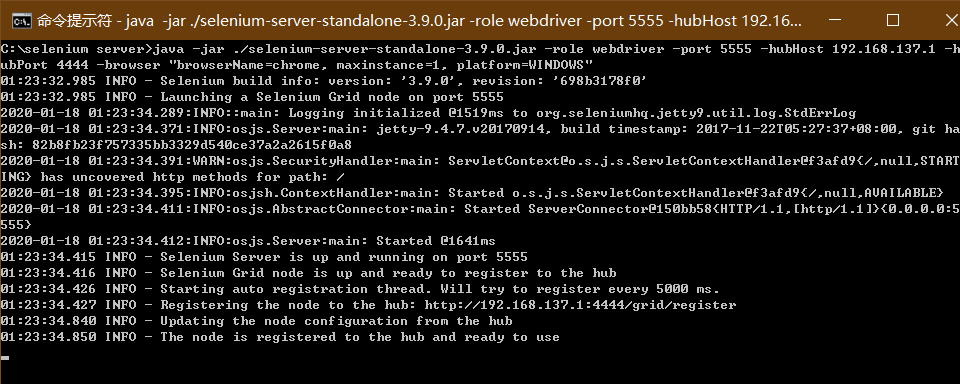
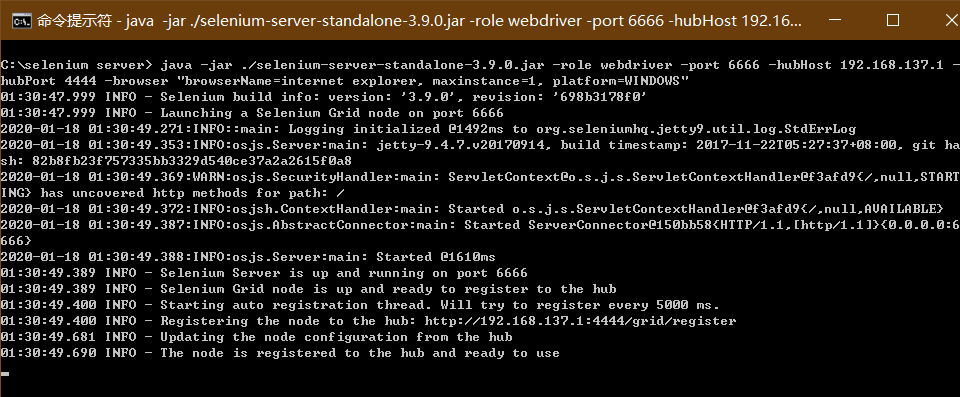
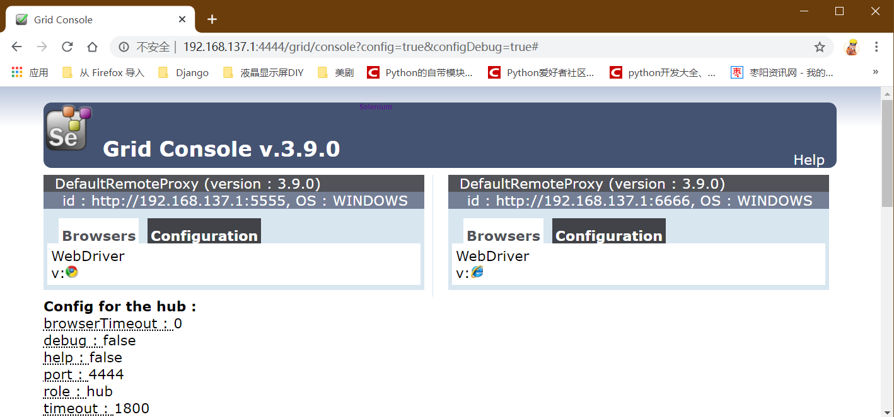

### selenium的使用
一、 selenium 的简单应用

```python
from selenium import webdriver
from selenium.webdriver.common.keys import Keys
driver = webdriver.Firefox()
driver.get("http://www.python.org")
assert "Python" in driver.title
elem = driver.find_element_by_name("q")
elem.clear()
elem.send_keys("pycon")
elem.send_keys(Keys.RETURN)
assert "No results found." not in driver.page_source
driver.close()
```

二、使用selenium控制浏览器模拟触摸设备
```
# 给浏览器定义启动参数
chrome_start_options = webdriver.ChromeOptions()
option_args = {"deviceName": "iPhone 6"}
chrome_start_options.add_experimental_option("mobileEmulation", option_args)
chrome_start_options.add_experimental_option("w3c", False)  # 重点

# 带参启动浏览器
chrome_001 = webdriver.Chrome(chrome_options=chrome_start_options)
chrome_001.maximize_window()

# 定义触控，下拉框选择
action_001 = TouchActions(chrome_001)
com_id_other_type_00 = chrome_001.find_element_by_xpath('//*[@id="oneLevelContain"]/ul/li[1]')
action_001.scroll_from_element(com_id_other_type_00, 0, 200)
action_001.perform()
```

三、在远端执行测试脚本
1. 远端计算机上需要安装Java、Selenium standalone server
    - 下载完成后的是个jar包【selenium-server-standalone-2.41.0.jar】

2. 在远端启动selenium standalone server
    - 在远端控制台执行`java -jar selenium-server-standalone-2.41.0.jar`
    >Pypi 上 selenium 原话
    Selenium Server (optional)
    For normal WebDriver scripts (non-Remote), the Java server is not needed.
    However, to use Selenium Webdriver Remote or the legacy Selenium API (Selenium-RC), you need to also run the Selenium server. The server requires a Java Runtime Environment (JRE).
    Download the server separately, from: http://selenium-release.storage.googleapis.com/3.141/selenium-server-standalone-3.141.0.jar
    Run the server from the command line:
    java -jar selenium-server-standalone-3.141.0.jar
    Then run your Python client scripts

3. 在远端启动服务之后，在本地访问远端计算机IP + 端口[http://192.168.0.122:4444/]
    - 本地访问远程机selenium standalone server 欢迎界面  
    
    - 本地访问远程机selenium standalone server 控制台界面  
    

4. 要在远端执行，需要使用RemoteWebDriver，相对于远端的selenium server就是一个客户端。
    
    - 配置`desired_capabilities`，来告诉远程机需要什么样的浏览器，什么样的操作系统和一些其他配置
    ```
    desired_caps = {}
    desired_caps[‘platform’] = ‘WINDOWS’
    desired_caps[‘browserName’] = ‘Chrome’
    ```
    - 根据上面的配置实例化一个Remote类
    ```
    self.driver = webdriver.Remote('http://192.168.0.122:4444/wd/hub', desired_caps)
    ```
    - 尝试写一段在远程端执行的[脚本](../../内容分类/python-selenium/remote_selenium.py)
    >如果报如下错误Driver info: driver.version: unknown，远程端需要安装浏览器对应的webdriver，并配置环境变量。
    然后重启远程端的服务。  

5. 在远端使用IE浏览器执行  
    - 添加IE浏览器的代码如下：，先打开firefox关闭后再打开IE浏览器
    ```python
    from selenium import webdriver
    import time
    
    # 配置`desired_capabilities`
    desired_caps = {}
    desired_caps['platform'] = 'WINDOWS'
    desired_caps['browserName'] = 'firefox'
    # 根据上面的配置实例化一个Remote类
    remote_firefox = webdriver.Remote('http://192.168.0.122:4444/wd/hub', desired_caps)
    remote_firefox.get("https://www.baidu.com")
    time.sleep(5)
    remote_firefox.close()
    
    # 配置IE浏览器
    desired_ie = {}
    desired_ie["platform"] = "WINDOWS"
    desired_ie["browserName"] = "internet explorer"  # 这里的浏览器名称不能写错，要按照server里面的来
    remote_ie = webdriver.Remote('http://192.168.0.122:4444/wd/hub', desired_caps)
    remote_ie.get("https://www.bilibili.com")
    ```


四、 selenium grid server(Hub)网格管理服务，可以使我们在一个有各种不同浏览器，各种不同的操作系统的复杂环境下执行测试时
可以同时在多台设备上同时执行  
1. 设置selenium server做为Grid
    - 在selenium server standalone的jar包所在的位置打开控制台，启动命令为：
    `java -jar selenium-server-standalone-xxx.jar -port 4444 -role hub`
2. 添加不同浏览器的节点
    - 添加IE浏览器的节点
    打开一个新的控制台窗口，执行如下指令：
    ```
    java -jar ./selenium-server-standalone-3.9.0.jar -role webdriver -port 6666 -hubHost 192.168.137.1 -hubPort 4444 -browser "browserName=internet explorer, maxinstance=1, platform=WINDOWS"
    ```
    - 命令解释：
    ```
    java -jar ./selenium-server-standalone-xxx.jar      # 启动服务
    -role webdriver                                     # 指定节点的角色为webdriver
    -port 5555                                          # 指定节点的端口为5555
    -hubHost 192.168.137.1                              # 指定将要连接的Hub的主机IP
    -hubPort 4444                                       # 指定将要连接的Hub的服务端口
    -browser "browserName=chrome, maxinstance=1, platform=WINDOWS"  # 指定节点的浏览器属性
        browserName=internet explorer   # 指定浏览器
        version=10                      # 指定浏览器版本
        maxinstance=1                   # 指定该节点最大实例化数量
        platform=WINDOWS                # 指定运行平台 
    ```
3. 在Hub上添加了两个节点之后的效果如下：
- Hub端启动后的状态:  
    >  
- node01启动后的状态:  
    >  
- node02启动后的状态:  
    >  
- 添加多个节点后的控制台:  
    >

4.也可能通过加载JSON格式的配置文件来启动节点  
-  JSON配置文件如下：
```
{
    "class": "org.openqa.grid.common.RegistrationRequest",
    "capabilities": 
    [
        {
            "seleniumProtocol": "WebDriver",
            "browserName": "internet explorer",
            "version": "10",
            "maxInstances": 1,
            "platform" : "WINDOWS"
        }
    ],
    "configuration": 
    {
        "port": 6666,
        "register": true,
        "host": "192.168.137.1",
        "proxy": "org.openqa.grid.selenium.proxy.DefaultRemoteProxy",
        "maxSession": 2,
        "hubHost": "192.168.137.1",
        "role": "webdriver",
        "registerCycle": 5000,
        "hub": "http://192.168.137.1:4444/grid/register",
        "hubPort": 4444,
        "remoteHost": "http://192.168.137.1:6666"
    }
}
```

- 启动节点时使用如下命令：
`java -jar seleniumserver-standalone-xxx.jar -role webdriver -nodeConfig selenium-node-winie10.cfg.json`

报错请参考：
https://github.com/SeleniumHQ/selenium/wiki/Grid2#configuring-the-nodes-by-json
看了一下 好像是 configuration 这一段不一样，明天再看吧。