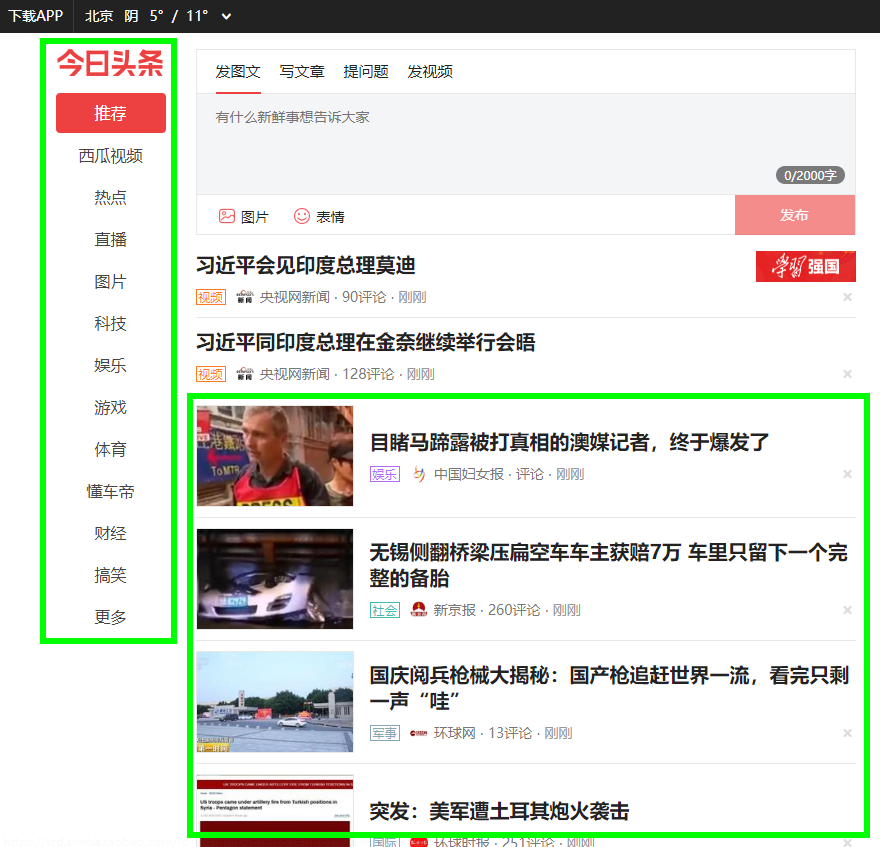
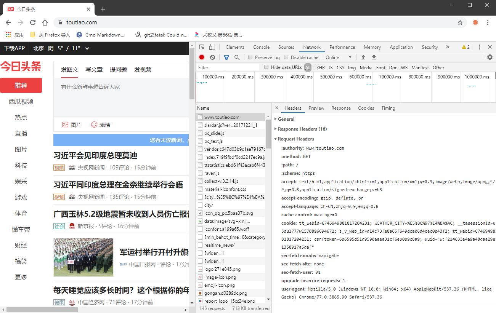

### 尝试爬虫爬取今日头条主页新闻列表

- #### 爬虫两个字竟然不会打，这里记录下：
    >- `爬`字的五笔码：`rhyc`
    >- `虫`字的五笔码`jhny`
    >- 爬虫：`rhjh[2]`

- #### [今日头条](https://www.toutiao.com)网址：`https://www.toutiao.com`
    >- 今日头条主页

    >- 图中绿框为爬取目标

- #### Python爬虫基本[模板](./worm_toutiao/getHtmlText.py)
    >- 模拟浏览器请求，获取主页资源
    >- 分析获取到的主页资源
    >- 对资源进行分类，归纳，整理，输出   

    使用Python requests获取主页资源时要用get()方法还是post()方法呢？打开浏览器开发工具，刷新一下主页，
    Network -> Header 中可以看到浏览器使用的是get()方法，并且可以看到报文头：
    ```
    :authority: www.toutiao.com
    :method: GET
    :path: /
    :scheme: https
    accept: text/html,application/xhtml+xml,application/xml;q=0.9,image/webp,image/apng,*/*;q=0.8,application/signed-exchange;v=b3
    accept-encoding: gzip, deflate, br
    accept-language: zh-CN,zh;q=0.9,en;q=0.8
    cache-control: max-age=0
    cookie: tt_webid=6746949881817204231; WEATHER_CITY=%E5%8C%97%E4%BA%AC; __tasessionId=u5qul777w1570896694672; s_v_web_id=d14c73fe8a65f649dca06d4cec0b43f2; tt_webid=6746949881817204231; csrftoken=6b6595d51d9590aaea31cf6eb0b9c8a9; uuid="w:f214633e4a9a48daa29e1358917a5daf"
    sec-fetch-mode: navigate
    sec-fetch-site: none
    sec-fetch-user: ?1
    upgrade-insecure-requests: 1
    user-agent: Mozilla/5.0 (Windows NT 10.0; Win64; x64) AppleWebKit/537.36 (KHTML, like Gecko) Chrome/77.0.3865.90 Safari/537.36
    ```
    
    
    通过上面的浏览器RequestHeader组装PythonRequests中get()方法用的报文头：
    ```python
    headers = {
        "Accept": "text/html,application/xhtml+xml,application/xml;"
                  "q=0.9,image/webp,image/apng,*/*;q=0.8,application/signed-exchange;v=b3",
        "Accept-Language": "zh-CN,zh;q=0.9,en;q=0.8",
        "Cache-Control": "max-age=0",
        "Connection": "keep-alive",
        "Cookie": "tt_webid=6746949881817204231;"
                  "WEATHER_CITY=%E5%8C%97%E4%BA%AC;"
                  "tasessionId=u5qul777w1570896694672;"
                  "s_v_web_id=d14c73fe8a65f649dca06d4cec0b43f2;"
                  "tt_webid=6746949881817204231;"
                  "csrftoken=6b6595d51d9590aaea31cf6eb0b9c8a9;"
                  "uuid='w:f214633e4a9a48daa29e1358917a5daf'",
        "Host": "www.toutiao.com",
        "Upgrade-Insecure-Requests": "1",
        "User-Agent": "Mozilla/5.0 (Windows NT 10.0; Win64; x64) "
                      "AppleWebKit/537.36 (KHTML, like Gecko) "
                      "Chrome/77.0.3865.90 "
                      "Safari/537.36",
    }
    ```
    使用request中的get()方法尝试请求，并打印一下响应：
    ```python
    # getHtmlText.py
    import requests
    
    
    target_url = 'https://www.toutiao.com'
    
    headers = {
        "Accept": "text/html,application/xhtml+xml,application/xml;"
                  "q=0.9,image/webp,image/apng,*/*;q=0.8,application/signed-exchange;v=b3",
        "Accept-Language": "zh-CN,zh;q=0.9,en;q=0.8",
        "Cache-Control": "max-age=0",
        "Connection": "keep-alive",
        "Cookie": "tt_webid=6746949881817204231;"
                  "WEATHER_CITY=%E5%8C%97%E4%BA%AC;"
                  "tasessionId=u5qul777w1570896694672;"
                  "s_v_web_id=d14c73fe8a65f649dca06d4cec0b43f2;"
                  "tt_webid=6746949881817204231;"
                  "csrftoken=6b6595d51d9590aaea31cf6eb0b9c8a9;"
                  "uuid='w:f214633e4a9a48daa29e1358917a5daf'",
        "Host": "www.toutiao.com",
        "Upgrade-Insecure-Requests": "1",
        "User-Agent": "Mozilla/5.0 (Windows NT 10.0; Win64; x64) "
                      "AppleWebKit/537.36 (KHTML, like Gecko) "
                      "Chrome/77.0.3865.90 "
                      "Safari/537.36",
    }
    
    
    if __name__ == "__main__":
        r = requests.get(url=target_url, headers=headers)
        print("响应状态码为：{}".format(r.status_code))
        print("响应的页面前1000个字符为：{}".format(r.text[:1000]))

    ```
    执行后输出为（为了便于展示，我手动给换行了）：
    ```
    响应状态码为：200
    响应的页面前1000个字符为：<!DOCTYPE html><html><head><meta charset=utf-8><title>今日头条</title>
    <meta http-equiv=x-dns-prefetch-control content=on><meta name=renderer content=webkit>
    <link rel=dns-prefetch href=//s3.pstatp.com/ ><link rel=dns-prefetch href=//s3a.pstatp.com/ >
    <link rel=dns-prefetch href=//s3b.pstatp.com><link rel=dns-prefetch href=//p1.pstatp.com/ >
    <link rel=dns-prefetch href=//p3.pstatp.com/ >
    <meta http-equiv=Content-Security-Policy content=upgrade-insecure-requests>
    <meta http-equiv=Content-Type content="text/html; charset=utf-8">
    <meta http-equiv=X-UA-Compatible content="IE=edge,chrome=1">
    <meta name=viewport content="width=device-width,initial-scale=1,maximum-scale=1,minimum-scale=1,user-scalable=no,minimal-ui">
    <meta name=360-site-verification content=b96e1758dfc9156a410a4fb9520c5956>
    <meta name=360_ssp_verify content=2ae4ad39552c45425bddb738efda3dbb>
    <meta name=google-site-verification content=3PYTTW0s7IAfkReV8wAECfjIdKY-bQeSkVTyJNZpBKE>
    <meta name=shenma-site-verification content=34c05607e2a9430ad424
    
    Process finished with exit code 0
    ```
    下面通过BeautifulSoup把获取到的html页面解析出来：
    ```python
    # beautifulsoup_parse.py
    import requests
    import bs4
    
    target_url = 'https://www.toutiao.com'
    
    headers = {
        "Accept": "text/html,application/xhtml+xml,application/xml;"
                  "q=0.9,image/webp,image/apng,*/*;q=0.8,application/signed-exchange;v=b3",
        "Accept-Language": "zh-CN,zh;q=0.9,en;q=0.8",
        "Cache-Control": "max-age=0",
        "Connection": "keep-alive",
        "Upgrade-Insecure-Requests": "1",
        "User-Agent": "Mozilla/5.0 (Windows NT 10.0; Win64; x64) "
                      "AppleWebKit/537.36 (KHTML, like Gecko) "
                      "Chrome/77.0.3865.90 "
                      "Safari/537.36",
    }
    
    # 今日头条主页左侧频道列表元素
    target_element_01_xpath = "/html/body/div/div[2]/div[1]/div/div"
    target_element_01_attrs_dic = {"class": "channel"}
    
    
    # 获取指定URL的响应
    def get_target_html(url_str):
        try:
            r = requests.get(url=target_url, headers=headers)
            print("请求url:\'" + url_str + "\'成功！")
            print("响应状态码：{}".format(r.status_code))
            with open("./r.html", "w", encoding="utf-8") as f:
                f.write(r.text)
            f.close()
            return r.text
        except:
            print("请求url:\'" + url_str + "\'失败！")
            return "请求url:\'" + url_str + "\'失败！"
    
    
    # 找到指定属性字典的元素bs4对象
    def get_element_by_attrs(html_str, attrs_dic):
        try:
            soup = bs4.BeautifulSoup(html_str, "html_parser")
            r = soup.find_all("div", attrs=attrs_dic)
            print("get_xpath_element() 找到指定元素：" + r.name())
            return r
        except:
            print("get_xpath_element() 未找到指定元素：{0}:{1}".format(attrs_dic.keys(), attrs_dic.values()))
            return
    
    
    if __name__ == "__main__":
        get_element_by_attrs(get_target_html(target_url), target_element_01_attrs_dic)

    ```    
    找到主页频道栏元素后，选中在右键功能菜单中复制`XPath`为：`/html/body/div/div[2]/div[1]/div/div`
    
    
- #### 问题遗留：
为什么通过`requests.get(url=target_url, headers=headers)`请求到的网页与浏览器展示的不一样？
发现是响应的html中的body与浏览器展示的不一样。需要进一步研究...


- #### 问题分析：
今日头条是动态HTML网页，爬虫不能执行那些让页面产生各种效果的 JavaScript 代码，但是浏览器可以。所以在浏览器上看到的内容，与使
用爬虫从网站上采集的内容不一样。用 Python 解决这个问题只有两种途径：直接从 JavaScript 代码里采集内容，或者用 Python 的第三
方库运行 JavaScript，直接采集你在浏览器里看到的页面

- #### 在Python中使用selenium执行JavaScript
selenium 不自带浏览器，它需要与第三方浏览器结合在一起使用。例如，如果在FireFox上运行Selenium，
可以直接看到一个FireFox窗口被打开，进入网站，然后执行在代码中设置的动作，虽然这样可以看得更清楚，
但是我们更喜欢让程序在后台运行，所以，使用一个叫[PhantomJS](https://phantomjs.org)的工具代替真实的浏览器。
PhantomJS是一个“无头”（headless）浏览器，它会把网站加载到内存并执行页面上的JavaScript，但是它
不会向用户展示网页的图形界面，把Selenium和Phantomjs结合在一起就可以运行一个非常强大的网络爬虫了，
可以处理cookie、JavaScript、header，以及任凭需要做的事情。

> - PhantomJS的安装使用，参考：[https://www.jianshu.com/p/80e984ef94d3](https://www.jianshu.com/p/80e984ef94d3)
> - selenium的安装使用，参考：...
> - 尝试获取网页上使用Ajax执行之后页面的内容：[# phantomjs_sele.py](./worm_toutiao/phantomjs_sele.py)
> - 执行后报如下错误：很明显，selenium已经不支持Phantomjs了，要使用Chrome 或者 Firefox 无界面浏览器驱动，想想我以前好像安装过Edge，
但是Edge不支持无界面浏览，所以得去安装下载Firefox。
    - chromedriver的下载地址：[http://chromedriver.storage.googleapis.com/index.html](http://chromedriver.storage.googleapis.com/index.html)
    - FireFix
```
UserWarning: Selenium support for PhantomJS has been deprecated, please use headless versions of Chrome or Firefox instead
```
> - 下载安装chromedriver，参考：[https://www.cnblogs.com/technologylife/p/5829944.html](https://www.cnblogs.com/technologylife/p/5829944.html)
> - 按照上面的操作完后，要重新启动一下PyCharm，我也不知道为什么。反正重启后就可以用了。
> - 尝试通过selenium驱动chrome获取网页上使用Ajax执行之后页面的内容： [# chrome_sele.py]()
```python
# phantomjs_sele.py
from selenium import webdriver
import time

target_url = 'https://www.toutiao.com'
target_element_01_xpath = "/html/body/div/div[2]/div[1]/div/div"

headers = {
    "Accept": "text/html,application/xhtml+xml,application/xml;"
              "q=0.9,image/webp,image/apng,*/*;q=0.8,application/signed-exchange;v=b3",
    "Accept-Language": "zh-CN,zh;q=0.9,en;q=0.8",
    "Cache-Control": "max-age=0",
    "Connection": "keep-alive",
    "Upgrade-Insecure-Requests": "1",
    "User-Agent": "Mozilla/5.0 (Windows NT 10.0; Win64; x64) "
                  "AppleWebKit/537.36 (KHTML, like Gecko) "
                  "Chrome/77.0.3865.90 "
                  "Safari/537.36",
}


driver_chrome = webdriver.Chrome()
driver_chrome.get(target_url)
time.sleep(5)

print(driver_chrome.find_element_by_xpath(target_element_01_xpath).text)
driver_chrome.close()
```

输出如下：
```
推荐
西瓜视频
热点
直播
图片
科技
娱乐
游戏
体育
懂车帝
财经
搞笑
更多
```

#### 遗留问题：可否在selenium驱动浏览器的时候不打开浏览器窗口？

> - #####使用以下方法在运行的时候可以不打开浏览器:

```python
# phantomjs_sele.py
from selenium import webdriver
import time

target_url = 'https://www.toutiao.com'
target_element_01_xpath = "/html/body/div/div[2]/div[1]/div/div"

# 使用以下方法在运行的时候可以不打开浏览器
option_headless = webdriver.ChromeOptions()
option_headless.add_argument("headless")
driver_chrome = webdriver.Chrome(chrome_options=option_headless)
driver_chrome.get(target_url)
time.sleep(5)

print(driver_chrome.find_element_by_xpath(target_element_01_xpath).text)
driver_chrome.close()
```


