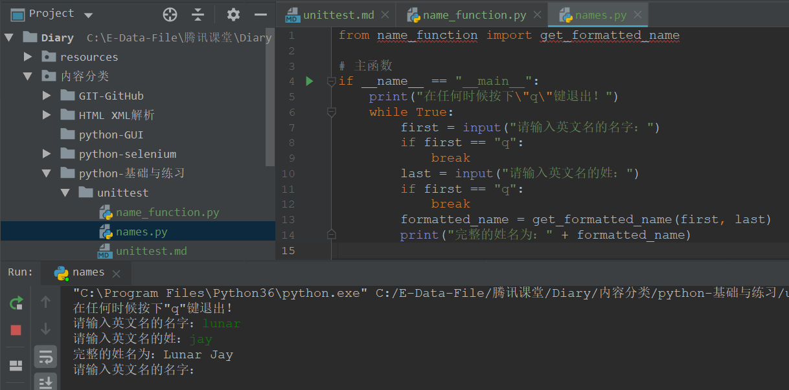
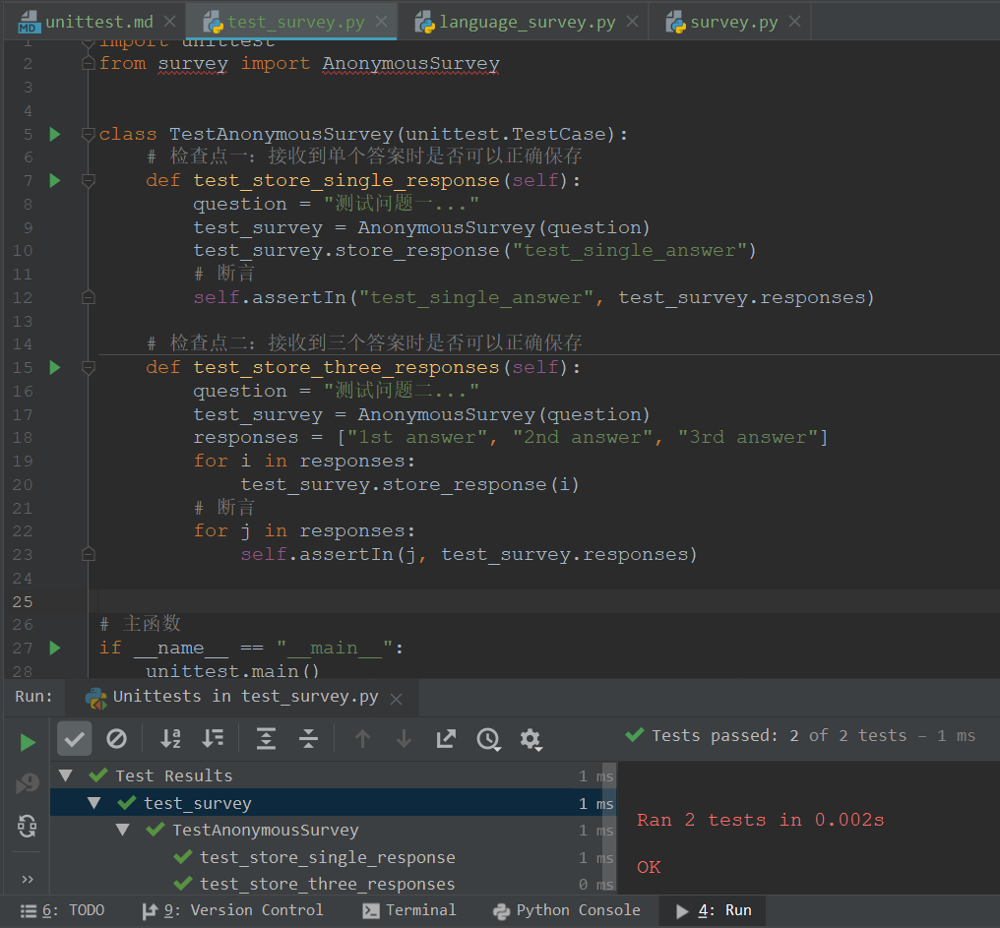

### 一、最开始的想法
✏肯定是想使用Python做自动化测试工作，目前学习了那么多Python的基础知识，但是如果自己
做起自动化测试又是不知如何下手。现在又回头翻起Python的基础书籍，从unittest模块开始
着手我的Python自动化测试。

### 二、Unittest
- 光是看文章会很枯燥，不如先来找个简单的例子执行吧。  
    - 1、写一段测试目标代码在[`name_function.py`](name_function.py)
    中编写`get_formatted_name`方法，在[`names.py`](names.py)
    中调用。
    > 在写上面这段代码的时候遇到问题“怎么把一个py文件(A.py)中的类或者方法(a)导入到另一个py
    文件(B.py)中？”
    
    > 1. 如果A.py和B.py在同一个目录下，只需要直接在B.py中使用`import A`或者
    `from A import a`
    
    > 2. 如果A.py和B.py不在同一个目录下，需要先将A.py文件的文件路径添加到环境变量
    中，再使用`import A`或者`from A import a`
    ```python
    # A.py文件的文件路径：C:\E-Data-File\腾讯课堂\Diary\内容分类\python-基础与练习\unittest
    
    # B.py文件：
    import sys
    sys.path.append(r'C:\E-Data-File\腾讯课堂\Diary\内容分类\python-基础与练习\unittest')
    '''python import模块时， 是在sys.path里按顺序查找的。
    sys.path是一个列表，里面以字符串的形式存储了许多路径。
    使用A.py文件中的函数需要先将他的文件路径放到sys.path中'''
    import A
    
    # 或者 from A import get_formatted_name
    ```
    
    - 2、 代码写好后可以正常的输入姓、名，输出格式化的完整姓名，如果修改`get_formatted_name`方法，
    使其还可以处理中间名，但是在运行names.py之前，修改过的`get_formatted_name`方法必须要经过测试。
    
    - 3、 为`name_function.py`创建测试[`test_name_function.py`](test_name_function.py)
        ```python
        # test_name_function.py
    
        import unittest
        from name_function import get_formatted_name
        
        
        # 测试name_function.py
        class NameTestCase(unittest.TestCase):
        
            # 检查处理只有姓和名的名字
            def test_first_last_name(self):
                formatted_name = get_formatted_name("mingzi", "xingshi")
                self.assertEqual(formatted_name, "Mingzi Xingshi")
        ```
        执行结果如下：  
        
        
    - 4、 修改`name_function.py`使在调用`get_formatted_name`时支持有中间名
    的名字。
        ```python
        def get_formatted_name(first, middle, last):
        """接受姓和名，返回完整的姓名"""
        full_name = first + " " + middle + " " + last
        return full_name.title()
        ```
        再执行刚才的测试结果如下：  
        
    在测试条件不变的情况下测试不通过说明，我们修改的代码有不符合预期的情况，所以我
    们分析`get_formatted_name`发现在修改支持中间名之后，在执行只有姓、名的场景
    下会测试不通过，所以修改中间名为可选参数，并在处理时增加判断。
        ```python
        def get_formatted_name(first, last, middle=""):
        """接受姓和名，返回完整的姓名"""
        if middle:
            full_name = first + " " + middle + " " + last
        else:
            full_name = first + " " + last
        return full_name.title()
        ```
        再次执行测试，结果如下：
        
    - 5、 在确定``又可以实现只有姓和名的名字处理时，我们下面增加测试有姓、名和中
    间名的名字处理，在测试类中增加一个测试方法：
        ```python
            # 检查处理有姓、名和中间名的名字
            def test_first_last_middle_name(self):
                formatted_name = get_formatted_name("fname", "lname", "mname")
                self.assertEqual(formatted_name, "Fname Mname Lname")
        ```
        测试执行结果如下：
        

- 测试一个类
    - 1、 一个要测试的类[`AnonymousSurvey`](survey.py)
        ```python
        # survey.py
        class AnonymousSurvey():
            """收集匿名调查问卷的答案"""
            def __init__(self, question):
                """存储一个问题，并为存储答案做准备"""
                self.question = question
                self.responses = []
        
            def show_question(self):
                """显示调查问卷"""
                print(self.question)
        
            def store_response(self, new_response):
                """存储单份调查答卷"""
                self.responses.append(new_response)
        
            def show_results(self):
                """显示收集到的所有答卷"""
                print("Survey results:")
                for response in self.responses:
                    print('- ' + response)
    
        ```
    - 2、 写一个使用这个类的程序[`language_survey.py`](language_survey.py)
        ```python
        from survey import AnonymousSurvey

        # 定义一个问题，创建关于这个问题的调查对象
        question = "你最喜欢做什么事？"
        my_survey = AnonymousSurvey(question)
        
        # 显示问题并存储答案
        my_survey.show_question()
        print("任何时候按下\"q\"退出程序。")
        while True:
            response = input("最喜欢做：")
            if response == "q":
                break
            my_survey.store_response(response)
        
        # 显示调查结果：
        print("谢谢参与！")
        my_survey.show_results()
        ```
    - 3、 测试`AnonymousSurvey`类，分别检查这个类的对象在接收到单个答案时是否
    可以正确保存，在接收到三个答案时是否可以正确保存。
        ```python
        import unittest
        from survey import AnonymousSurvey
        
        
        class TestAnonymousSurvey(unittest.TestCase):
            # 检查点一：接收到单个答案时是否可以正确保存
            def test_store_single_response(self):
                question = "测试问题一..."
                test_survey = AnonymousSurvey(question)
                test_survey.store_response("test_single_answer")
                # 断言
                self.assertIn("test_single_answer", test_survey.responses)
        
            # 检查点二：接收到三个答案时是否可以正确保存
            def test_store_three_responses(self):
                question = "测试问题二..."
                test_survey = AnonymousSurvey(question)
                responses = ["1st answer", "2nd answer", "3rd answer"]
                for i in responses:
                    test_survey.store_response(i)
                # 断言
                for j in responses:
                    self.assertIn(j, test_survey.responses)
        
        
        # 主函数
        if __name__ == "__main__":
            unittest.main()
        ```
        测试执行结果如下：
        
    - 4、 上面的测试有效果，但是测试代码有重复的地方，每个测试方法中分别创建了一
    个`AnonymousSurvey`实例，并且每个测试方法中都使用到了测试的问题和答案。
    unittest.TestCase类中的`setUp()`方法，在每次执行`test_`测试方法之前都要先
    执行setUp()方法。从这一点我们可以优化上面的测试代码：
        ```python
        import unittest
        from survey import AnonymousSurvey
        
        
        class TestAnonymousSurvey(unittest.TestCase):
            # setUp方法，创建测试用的测试问题，调查对象，答案
            def setUp(self):
                question = "测试问题XXX..."
                self.test_survey = AnonymousSurvey(question)
                self.responses = ["1st answer", "2nd answer", "3rd answer"]
        
            # 检查点一：接收到单个答案时是否可以正确保存
            def test_store_single_response(self):
                self.test_survey.store_response(self.responses[0])
                # 断言
                self.assertIn(self.responses[0], self.test_survey.responses)
                del self.test_survey
        
            # 检查点二：接收到三个答案时是否可以正确保存
            def test_store_three_responses(self):
                for i in self.responses:
                    self.test_survey.store_response(i)
                # 断言
                for j in self.responses:
                    self.assertIn(j, self.test_survey.responses)
                del self.test_survey
        
        
        # 主函数
        if __name__ == "__main__":
            unittest.main()
        ```
    - 5、 通过setUp()方法优化后的代码确实精简了一些，但是对于计算机来说压力并没
    有减少，在每次执行test方法之前都会先执行一次setUp方法，所以在仍然会为每个测
    试方法创建一个新的实例。下面通过unittest的类修饰器来实现在同一个测试类中只执
    行一次setUp方法：
        ```python
            # setUp方法，创建测试用的测试问题，调查对象，答案
            @classmethod
            def setUpClass(cls):
                question = "测试问题XXX..."
                cls.test_survey = AnonymousSurvey(question)
                cls.responses = ["1st answer", "2nd answer", "3rd answer"]
        ```
        就是把setUp方法换成使用类方法修饰器，在同一个类执行的时候先执行类修饰方
        法`setUpClass`，所以代码就这样了：
        ```python
        import unittest
        from survey import AnonymousSurvey
        
        
        class TestAnonymousSurvey(unittest.TestCase):
            # setUp方法，创建测试用的测试问题，调查对象，答案
            @classmethod
            def setUpClass(cls):
                question = "测试问题XXX..."
                cls.test_survey = AnonymousSurvey(question)
                cls.responses = ["1st answer", "2nd answer", "3rd answer"]
        
            # 检查点一：接收到单个答案时是否可以正确保存
            def test_store_single_response(self):
                self.test_survey.store_response(self.responses[0])
                # 断言
                self.assertIn(self.responses[0], self.test_survey.responses)
        
            # 检查点二：接收到三个答案时是否可以正确保存
            def test_store_three_responses(self):
                for i in self.responses:
                    self.test_survey.store_response(i)
                # 断言
                for j in self.responses:
                    self.assertIn(j, self.test_survey.responses)
        
        
        # 主函数
        if __name__ == "__main__":
            unittest.main()

        ```
- 经过上面的两个测试例子，对unittest的执行大致有了一个了解，下面开始详细学习。
unittest最核心的部分是`TestFixture`，`TestCase`，`TestSuite`，`TestRunner`

    - 1、 TestFixture：
        > 用于一个测试环境的准备和销毁还原。当测试用例每次执行之前需要准备测试环境，
        每次执行完成后需要还原测试环境，比如执行前连接数据库，打开浏览器等，执行完成
        后需要还原数据库，关闭浏览器等操作。这时候可以启用TestFixture。
        
        TestFixture包括：
        - setUp()——准备环境，执行每个测试方法（test_）的前置
        - tearDown()——环境还原，执行每个测试方法的后置
        - setUpClass()——必须使用`@classmethod`装饰器，所有测试方法的前置，只运行一次
        - tearDownClass()——必须使用`@classmethod`装饰器，所有测试方法的后置，只运行一次
        
        在测试执行时，如果setUp()引发异常，测试框架会认为测试发生了错误，因此测试方法不会被执行
        如果setUp()成功运行，无论测试方法是否成功，都会执行tearDown()。这样的一个测试代码运行
        的环境被称为TextFixture
    - 2、`TestCase`：
        > `unittest`提供一个基类：`TestCase` ，用于新建测试用例。一个从
        `unittest.TestCase`继承的类，就是一个独立的单元测试用例，就是一个完整
        的测试流程。包括测试前准备（setUp()或setUpClass()等），代码执行，正确
        性检查，测试后的环境还原（tearDown()或testDownClass()等）。一个测试
        用例检查输入特定的数据时的响应。
        - setUp()
            >白话讲就是一个设置方法，在执行每一个以test开头的测试方法之前都会调用这个setUp()一次。
            但是如果，在setUp()方法中出现了异常或错误，不会被认为是测试跳过或者是测试失败。setUp()方法的默认实现什么都不做。
        - tearDown()
            >也是一个设置方法，这个tearDown()会在每一个以test开头的测试方法执行完并记录测试结果后调用一次。
            即使测试方法中出现了异常，这个方法也会执行，所以在子类的实现中一定要仔细检查tearDown()。这个方法只有在setUp()方法成功执行后
            才会调用，不管测试方法的结果怎样。tearDown()方法的默认实现什么都不做。
        - setUpClass()
            >是一个类方法，只有被classmethod装饰器装饰的类才会在类实现的测试方法之前调用。
            像这样：
            ```python
            @classmethod
            def setUpClass(cls):
            ...
            ```
        - tearDownClass()
            >是一个类方法，只有被classmethod装饰器装饰的类才会在类实现的测试方法之后调用。
            像这样：
            ```python
            @classmethod
            def tearDownClass(cls):
            ...
            ```
        - run(result=None)
            >执行测试，返回一个测试结果给到TestResult类的result。如果调用run()方法的时候未传入result或者为空，
            则会调用defultTestResult()创建一个临时的结果对象并返回。
        - skipTest(reason)
            > Unittst 支持跳过指定测试方法，也可以跳转整个类的测试方法，而且可以标记预期
            失败（测试中断或者失败但是不在测试结果中记录失败数）的测试方法。跳过测试使用
            `skip()`装饰器或者它的条件形式。
            - `@unittest.skip(reason)`跳过被此装饰器装饰的测试。reason 为测试被跳过的原因。
            - `@unittest.skipIf(condition, reason)`当condition 为真时，跳过被装饰的测试。
            - `@unittest.skipUnless(condition, reason)`跳过被装饰的测试，除非condition 为真。
            - `@unittest.expectedFailure`把测试标记为预计失败。
            如果测试不通过，会被认为测试成功；如果测试通过了，则被认为是测试失败。
            - 修改我们的测试类，如下
            ```python
            import unittest
            from survey import AnonymousSurvey
            import sys
            
            
            class TestAnonymousSurvey(unittest.TestCase):
                # setUp方法，创建测试用的测试问题，调查对象，答案
                @classmethod
                def setUpClass(cls):
                    question = "测试问题XXX..."
                    cls.test_survey = AnonymousSurvey(question)
                    cls.responses = ["1st answer", "2nd answer", "3rd answer"]
            
                # 检查点一：接收到单个答案时是否可以正确保存
                def test_store_single_response(self):
                    self.test_survey.store_response(self.responses[0])
                    # 断言
                    self.assertIn(self.responses[0], self.test_survey.responses)
            
                # 检查点二：接收到三个答案时是否可以正确保存
                @unittest.skip("跳过测试接收到三个答案的场景！")
                def test_store_three_responses(self):
                    for i in self.responses:
                        self.test_survey.store_response(i)
                    # 断言
                    for j in self.responses:
                        self.assertIn(j, self.test_survey.responses)
            
                # 跳过测试演示
                lp = "C:\\E-Data-File\\腾讯课堂\\Diary\\内容分类\\python-基础与练习\\unittest"
                @unittest.skipIf(AnonymousSurvey.__path__ == lp, "测试路径正确，跳过测试。")
                def test_pathtest(self):
                    print("如果打印这条消息，说明测试路径不对。")
            
                # 跳过测试演示
                @unittest.skipUnless(sys.platform.startswith("linux"), "只在Linux平台下执行这条测试")
                def test_platforinfo(self):
                    print("如果打印这条消息，说明当前是在Linux平台测试")
            
            
            # 主函数
            if __name__ == "__main__":
                unittest.main()
            ```
            会看到如下测试结果：
            ```
            Skipped: 测试路径正确，跳过测试。
            
            Skipped: 只在Linux平台下执行这条测试
            
            Skipped: 跳过测试接收到三个答案的场景！
            
            
            Ran 4 tests in 0.003s
            
            OK (skipped=3)
            ```
        - subTest(msg=None, **params)
            >上下文管理器，具体怎么用，在什么场景下使用等后面有这块的需求再补充吧。...
            ...
        - debug()
            >不收集测试结果来执行测试，
        - assert*()
            >测试方法中的断言方法，各种各样的断言方法要用的时候直接查文档吧。这里不复制了。
        - fail(msg=None)
            >无条件地标识一个测试方法为测试失败状态，用msg描述错误信息。
        
    - 3、 TestSuite
        > 是一系列的TestCase，或TestSuite，或者两者都有。它用于归档需要一起执行
        的测试。
    - 4、 TestRunner 和 TestSuite：
        > TestRunner是一个用于执行和输出测试结果的组件。这个TestRunner可能使用图
        形接口、文本接口、或返回一个特定的值表示运行测试的结果。可以参考以下方法自定
        义你的测试套件。
        ```python
        def suite():
            suite = unittest.TestSuite()
            suite.addTest(WidgetTestCase('test_default_widget_size'))
            suite.addTest(WidgetTestCase('test_widget_resize'))
            return suite
        if __name__ == '__main__':
            runner = unittest.TextTestRunner()
            runner.run(suite())
        ```
    - 5、使用FunctionTestCase类
        > unittest 提供`FunctionTestCase`类。这个TestCase 的子类可用于打包已有的测试函数，
        并支持设置前置与后置函数。虽然FunctionTestCase可以快速地将现有的测试方法转换成unittest
        的测试类实例，但是并不推荐这样做。花时间去编写适当的TestCase类，会便于将来重构测试。
        - 假设有如下测试方法：
        ```python
        def testSomething():
        something = makeSomething()
        assert something.name is not None
        # ...
        ```
        - 可以创建等价的测试用例如下，其中前置和后置方法是可选的。
        ```python
        testcase = unittest.FunctionTestCase(testSomething,
        setUp=makeSomethingDB,
        tearDown=deleteSomethingDB)
        ```
- 组织测试代码Grouping tests
.
.
.

---


【文章1】https://segmentfault.com/a/1190000016315201?utm_source=tag-newest
