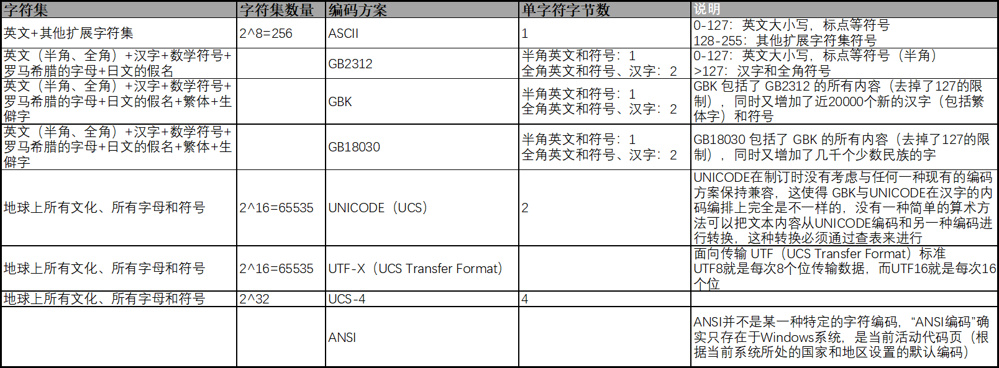

# 写在前面
>最近打开一个文件时出现英文可以正常显示，但是中文显示乱码的情况。查阅了一些文件的编码与解码的知识，这里做下笔记。

## 什么是编码，为什么要编码
- 计算机只能处理`0101...`这样的二进制数据，人类（Human）是不能自然读取的；
- 将自然语言转换成计算机可以处理的二进制数据的过程叫**编码**；
- 需要转换成二进制数据的字符集合叫**字符集**，不同的自然语言有不同的字符集；
- 将二进制数据转换成自然语言的过程叫**解码**；
- 字符集使的编码/解码规则，就是字符集编码方案（规则）；



### 说明
- "ASCII"：美国信息互换标准代码（American Standard Code for Information Interchange）
- "UCS"：通用多八位编码字符集（Universal Multiple-Octet Coded Character Set），俗称 "UNICODE"
- "ANSI"：并不是某一种特定的字符编码，而是在不同地区的Windows操作系统中表示当地默认编码的一种表示。

## Windows中的编码
- 上面说了在Windows系统中，不同地区的默认编码是不一样的，在中国大陆地区Windows系统的默认编码为`GB2312`
- Windows系统中使用活动代码页标记不同的编码，其中936代表GB2312
    >查看Windows系统当前默认的编码：
    >```shell script
    >C:\Users\lywte>chcp
    >活动代码页: 936
    >```

### Windows平台的软件使用的编码
- 有一些软件会使用系统默认的编码方式为自己的默认编码方式保存文件，很容易保存成GBK或GB2312的
- 有一些软件会使用utf-8为自己的默认编码方式保存文件
- UNICODE在制订时没有考虑与任何一种现有的编码方案保持兼容，这使得 GBK系与UNICODE系在汉字的内码编排上完全是不一样的，没有一种简单的算术方法可以把文本内容从UNICODE编码和另一种编码进行转换，这种转换必须通过查表来进行
